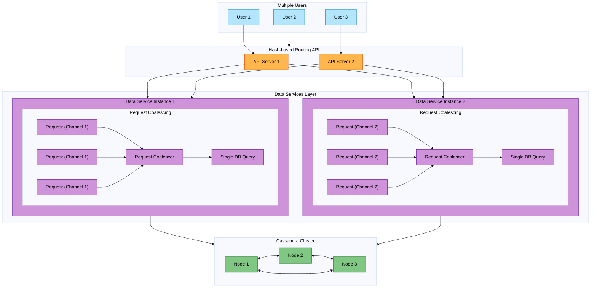

# Data Services

A high-performance, distributed data access layer implementing request coalescing and hash-based routing to reduce database load and prevent hot partitions. 

## Overview

Data Services is a middleware layer that sits between API servers and Cassandra clusters, providing request coalescing. It's designed to handle high-traffic scenarios efficiently by reducing duplicate database queries and preventing database overload.
It is inspired by Discord's architecture explained in their blog post: [HOW DISCORD STORES TRILLIONS OF MESSAGES](https://discord.com/blog/how-discord-stores-trillions-of-messages).

An example of usecase from Discord is when a big announcement is sent on a large server (Discord group) that notifies @everyone: users are going to open the app and read the same message, sending tons of traffic to the database. This is where request coalescing comes in handy, as it can combine all the requests for the same data into a single database query, reducing the load on the database and preventing hot partitions.

A simpler way of understanding it is: caching with the duration equal to the time spent running the query. No client has to be aware of the coalescing because the max amount of staleness is the same as if each client had run the query themselves. It also doesn't require extra memory, because the query result falls out of scope as soon as it is sent to all waiters.

### Key Features

- **Request Coalescing**: Automatically combines duplicate requests for the same data into a single database query
- **Consistent Hash-based Routing**: Routes related requests to the same service instance for optimal coalescing
- **Distributed Architecture**: Multiple service instances working in parallel
- **High Availability**: Data service nodes are stateless and can be scaled horizontally
- **Monitoring**: Built-in metrics for tracking requests and queries counts

## Setup

```bash
$ docker-compose up --build
```
Wait for the services to start up. The Cassandra cluster will be initialized with the required keyspace. You will see something like this in the logs that shows that the data service instances are ready to accept requests:
```
data-service1-1   | 2024/10/26 16:18:45 Connected to cassandra
data-service1-1   | 2024/10/26 16:18:45 Starting server on port 50051
data-service2-1   | 2024/10/26 16:18:45 Connected to cassandra
data-service2-1   | 2024/10/26 16:18:45 Starting server on port 50052
```

Run the client CLI to send test requests to the data service:
```bash
$ go run ./client -h
  -channels int
        Number of unique channels to distribute requests across (number of unique requests) (default 20)
  -requests int
        Total number of requests to send (default 10000)
```


Example usage:
```
$ go run ./client
2024/10/26 17:08:11 Unique requests: 20, Total requests: 10000, Total queries executed: 184
2024/10/26 17:08:11 Average queries per request: 0.0184
2024/10/26 17:08:11 Saved queries by coalescing: 9816
2024/10/26 17:08:11 Total time taken: 816.727364ms
```

## Architecture

### Components

1. **Data Service Nodes**: gRPC servers that handle incoming requests and manage database connections
2. **Cassandra Cluster**: A 3-node Cassandra cluster for data storage
3. **Client**: gRPC Test client for simulating high-traffic scenarios



## Technical Learnings

### Go Concurrency Patterns
1. **Channels**
   - Used for async communication between goroutines
   - Each request is in its own goroutine with a channel for response from the query executer goroutine

2. **Mutex Operations**
   - Implemented thread-safe access to shared resources

3. **Atomic Operations**
   - Used lock-free atomic counters for metrics tracking

4. **WaitGroups**
   - Used for waiting on multiple goroutines to complete in the CLI client

5. **Context Management**
   - Used context for request timeouts and cancellation


### gRPC Implementation
- Defined service interfaces using Protocol Buffers
- Managed timeout handling using context

### Docker and Container Orchestration
- Implemented health checks for service readiness
- Managed container dependencies and startup order
- Configured networking between services
- Implemented volume management for data persistence

## Future Improvements

1. **Monitoring & Observability**
   - Add distributed tracing

2. **Scalability**
   - Implement dynamic service discovery (e.g. Consul or etcd)

3. **Resilience**
   - Add circuit breakers
   - Implement retry policies
   - Add rate limiting

## License

This project is licensed under the MIT License.
